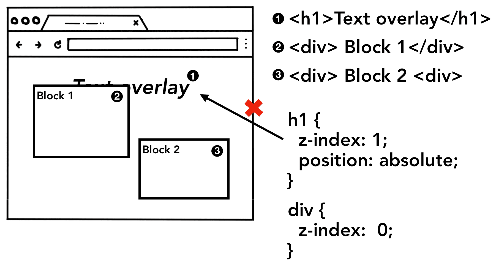
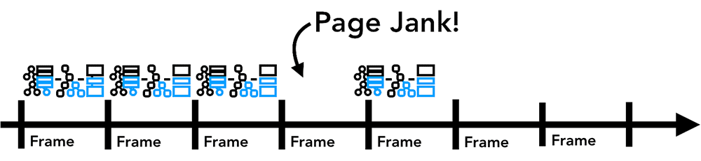

# Key concepts from inside look at a modern browser part 3

### The Renderer Process
- The renderer process is responsible for handling everything that happens inside of the tab. 
- It has the a main thread which handles the javascript, parsing, and rendering etc.
- It is able to do that with the help of the threads it has, the main thread, the compositor thread, the worker threads, and the raster threads.

### PARSING
## Construction of the DOM
- When the renderer receieves a commit message for a navigation and starts to receive HTML data, the main thread starts to parse the text string and turns it into a DOM
- The DOM is a browser's internal representation of the page as well as the data structure and API that web developer can interact with via JavaScript.

NOTE
- Parsing and HTML document is defined by the HTML Standard and you may notice that no matter what mistake you make in the way you write HTML it will be considered correct because it was designed to handle mistakes gracefully.

## Subresource loading
- A website uses external resources like CSS and javascript. These sources can be loaded from the cache or from the networok.
- To speed up the process instead of requesting them one by one as they find them while parsing the DOM, "preload scanner" is run concurrently.
- The preload scanner peaks at tokens generated by and sends requests to the network thread in the browser process

### JavaScript can block the parser
- When the HTML parser finds a <script> tag, it pauses the parsing of the HTML document and has to load, parse, and execute the JavaScript code.
- Why? because JavaScript can change the shape of the document using things like document.write() which changes the entire DOM structure

### Hints to the browser
- There are many ways web developers can send hints to the browser in order to load resources nicely. If your JavaScript does not use document.write(), you can add async or defer attribute to the <script> tag. The browser then loads and runs the JavaScript code asynchronously and does not block the parsing.

- You may also use JavaScript module if that's suitable. <link rel="preload"> is a way to inform browser that the resource is definitely needed for current navigation and you would like to download as soon as possible. You can read more on this at Resource Prioritization.

### Style calculation
- Having a DOM is not enough to know what the page would look like because we can style page elements in CSS. 
- The main thread parses CSS and determines the computed style for each DOM node. 
- This is information about what kind of style is applied to each element based on CSS selectors. You can see this information in the computed section of DevTools.

NOTE:
- Even if there is no CSS provided, each DOM node has a default style and this is because the browser has a default stylesheet.

### Layout
- Now the renderer process knows the structure of a document and styles for each nodes, but that is not enough to render a page.

- Imagine you are trying to describe a painting to your friend over a phone. "There is a big red circle and a small blue square" is not enough information for your friend to know what exactly the painting would look like.

- The layout is a process to find the geometry of elements. The main thread walks through the DOM and computed styles and creates the layout tree which has information like x y coordinates and bounding box sizes. 

- Layout tree may be similar structure to the DOM tree, but it only contains information related to what's visible on the page. 

NOTE
There are some styles that can be written in CSS that are included or not included in the layout tree like display:none is not included in the layout tree yet visibility:hidden is included. Similarly, if a pseudo-element with content like p::before{content:"Hi!"} is applied, it is included in the layout tree even though that is not in the DOM.

NOTE
Determining the Layout of a page is a challenging task. Even the simplest page layout like a block flow from top to bottom has to consider how big the font is and where to line break them because those affect the size and shape of a paragraph; which then affects where the following paragraph needs to be.

CSS can make element float to one side, mask overflow item, and change writing directions. You can imagine, this layout stage has a mighty task. In Chrome, a whole team of engineers works on the layout. If you want to see details of their work, few talks from BlinkOn Conference are recorded and quite interesting to watch.

### Paint

- Having the DOM, style and layout is still not enough because you have no idea what the order of drawing is and i mean, which element comes first
- You know the size, shape, and location of elements, but you still have to judge in what order you paint them. For example, z-index might be set for certain elements, in that case painting in order of elements written in the HTML will result in incorrect rendering.

Page elements appearing in order of an HTML markup, resulting in wrong rendered image because z-index was not taken into account

Soooooo what do we do 

## Paint records
At this paint step, the main thread walks the layout tree to create paint records. 
- Paint record is a note of painting process like "background first, then text, then rectangle". If you have drawn on <canvas> element using JavaScript, this process might be familiar to you.

The main thread walking through layout tree and producing paint records

DOM+Style, Layout, and Paint trees in order it is generated

NOTE
The most important thing to grasp in rendering pipeline is that at each step the result of the previous operation is used to create new data. For example, if something changes in the layout tree, then the Paint order needs to be regenerated for affected parts of the document.

If you are animating elements, the browser has to run these operations in between every frame. Most of our displays refresh the screen 60 times a second (60 fps); animation will appear smooth to human eyes when you are moving things across the screen at every frame. However, if the animation misses the frames in between, then the page will appear "janky".

Even if your rendering operations are keeping up with screen refresh, these calculations are running on the main thread, which means it could be blocked when your application is running JavaScript.

You can divide JavaScript operation into small chunks and schedule to run at every frame using requestAnimationFrame(). For more on this topic, please see Optimize JavaScript Execution . You might also run your JavaScript in Web Workers to avoid blocking the main thread.

### Compositing 
 - Now that the browser knows the structure of the document, the style of each element, the geometry of the page, and the paint order, how does it draw a page? Turning this information into pixels on the screen is called rasterizing.

- Perhaps a naive way to handle this would be to raster parts inside of the viewport. If a user scrolls the page, then move the rastered frame, and fill in the missing parts by rastering more. This is how Chrome handled rasterizing when it was first released. However, the modern browser runs a more sophisticated process called compositing.

Compositing = taking already-painted layers and putting them together on screen, without re-painting them.

- Compositing is a technique to separate parts of a page into layers, rasterize them separately, and composite as a page in a separate thread called compositor thread. If scroll happens, since layers are already rasterized, all it has to do is to composite a new frame. Animation can be achieved in the same way by moving layers and composite a new frame.

## Dividing into layers
- In order to find out which elements need to be in which layers, the main thread walks through the layout tree to create the layer tree (this part is called "Update Layer Tree" in the DevTools performance panel). If certain parts of a page that should be separate layer (like slide-in side menu) is not getting one, then you can hint to the browser by using will-change attribute in CSS.

- You might be tempted to give layers to every element, but compositing across an excess number of layers could result in slower operation than rasterizing small parts of a page every frame, so it is crucial that you measure rendering performance of your application. For more about on topic, see Stick to Compositor-Only Properties and Manage Layer Count.

## Raster and composite off the main thread
- Once the layer tree is created and paint orders are determined, the main thread commits that information to the compositor thread. The compositor thread then rasterizes each layer. A layer could be large like the entire length of a page, so the compositor thread divides them into tiles and sends each tile off to raster threads. Raster threads rasterize each tile and store them in GPU memory.

- The compositor thread can prioritize different raster threads so that things within the viewport (or nearby) can be rastered first. A layer also has multiple tilings for different resolutions to handle things like zoom-in action.

Once tiles are rastered, compositor thread gathers tile information called draw quads to create a compositor frame.

Draw quads ==== Contains information such as the tile's location in memory and where in the page to draw the tile taking in consideration of the page compositing.

Compositor frame ====	A collection of draw quads that represents a frame of a page.

A compositor frame is then submitted to the browser process via IPC. At this point, another compositor frame could be added from UI thread for the browser UI change or from other renderer processes for extensions. These compositor frames are sent to the GPU to display it on a screen. If a scroll event comes in, compositor thread creates another compositor frame to be sent to the GPU.

The benefit of compositing is that it is done without involving the main thread. Compositor thread does not need to wait on style calculation or JavaScript execution. This is why compositing only animations are considered the best for smooth performance. If layout or paint needs to be calculated again then the main thread has to be involved.