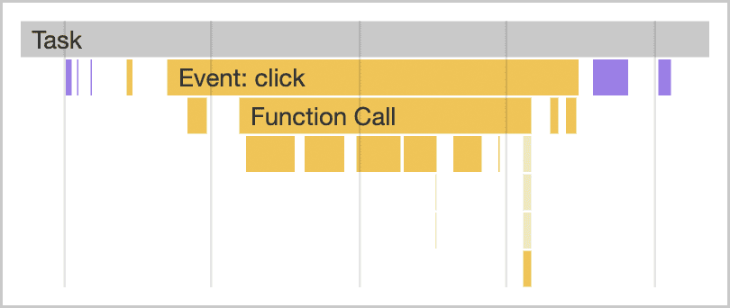
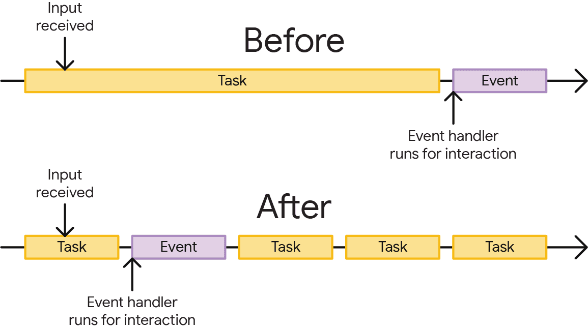

# The Main thread

## What is a task?
A task is any discrete piece of work that the browser does. 

- That work includes rendering, parsing HTML and CSS, running JavaScript, and other types of work you may not have direct control over. Of all of this, the JavaScript you write is perhaps the largest source of tasks.

# Tasks associated with JavaScript impact performance in a couple of ways:

- When a browser downloads a JavaScript file during startup, it queues tasks to parse and compile that JavaScript so it can be executed later.

- At other times during the life of the page, tasks are queued when JavaScript does work such as responding to interactions through event handlers, JavaScript-driven animations, and background activity such as analytics collection.

- The main thread can only process one task at a time. Any task that takes longer than 50 milliseconds is a long task. For tasks that exceed 50 milliseconds, the task's total time minus 50 milliseconds is known as the task's blocking period.

- The browser blocks interactions from occurring while a task of any length is running, but this is not perceptible to the user as long as tasks don't run for too long. When a user attempts to interact with a page when there are many long tasks, however, the user interface will feel unresponsive, and possibly even broken if the main thread is blocked for very long periods of time.

## Break the long task into smaller ones

- This matters because when tasks are broken up, the browser can respond to higher-priority work much sooner—including user interactions. Afterward, remaining tasks then run to completion, ensuring the work you initially queued up gets done.

TBH
